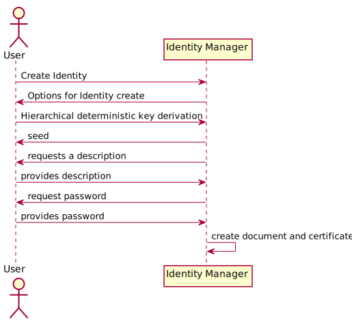
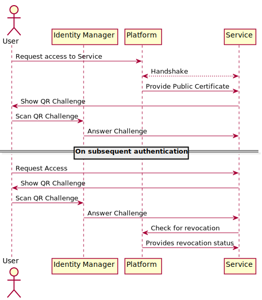
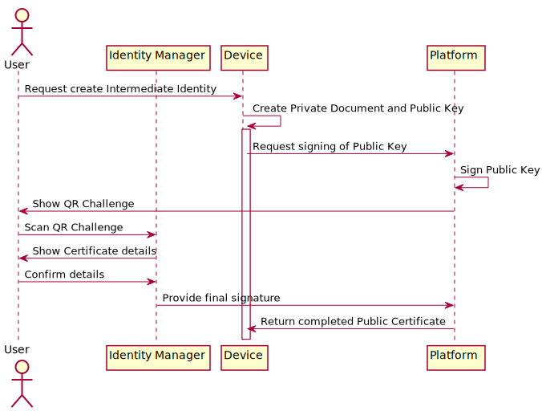

Open Metaverse Id
=================

Open Metaverse Id (OMID) is a simple, platform independent, method of identifying people in the
metaverse.

> This is primarily a thought experiment, more work needs to be done to turn it into a
> specification. I would love to work on this further with others.

Contents
--------

1. [Abstract](#abstract)
2. [Features](#features) 
3. [Terminology](#terminology)
   1. [Participants](#participants)
   2. [Components](#components)
4. [Explanation](#explanation)
   1. [Root Identity](#root-identity)
   2. [Intermediate Identity](#intermediate-identity)
5. [Example Usage](#example-usage)
    1. [Creating a Root Identity](#creating-a-root-identity)
    2. [Using a Root Identity to authenticate with a Platform](#using-a-root-identity-to-authenticate-with-a-platform)
    3. [Using a Root Identity to authenticate with a Service directly](#using-a-root-identity-to-authenticate-with-a-service-directly)
    3. [Using a Root Identity to authenticate with a Service via a Platform](#using-a-root-identity-to-authenticate-with-a-service-via-a-platform)
    4. [Creating an Intermediate Identity for use on a device](#creating-an-intermediate-identity-for-use-on-a-device)
    6. [Intermediate identity revocation](#intermediate-identity-revocation)
    7. [Root Identity revocation](#root-identity-revocation)
6. [Frequently Asked Questions](#frequently-asked-questions)
    1. [Why does the user sign the platforms certificate and not the other way around?](#why-does-the-user-sign-the-platforms-certificate-and-not-the-other-way-around)
7. [Alternatives](#alternatives)
8. [Unanswered Questions](#unanswered-questions)

Abstract
--------

At the time of writing, "metaverse" is _just_ a buzzword, one that means different things to
different people. It is not something that exists, but is an idea of an interconnected future. A
common theme in these ideas though is that a user can traverse different services within the
metaverse and keep the same identity as they move from place to place. In its simplest form, this
could mean that your avatar (your representation in the metaverse) might remain the same as you move
from your virtual office to your favourite games.

Some form of Metaverse seems inevitability. Not as a new separate thing, but as an extension to
existing technologies like the Internet. There are many opportunities that the Metaverse will unlock
for its users, in particular, new ways to collaborate, create, play and trade with each other.

In order to enable this though, we must have a consistent way of identifying each other across
different services and platforms. This document proposes a method for doing this.

In order to Identify users we must satisfy the following features:
- Users can use Identities to locate each other across the metaverse
- Platforms and Services can use Identities to authenticate returning users
- A user's private information must not be revealed through their public Identity
- A user's Identity must work across multiple services to enable a consistent experience for the
  user
- A user can use their Identity across multiple devices

Luckily, we don't need to create anything new to achieve this. This can all be done using Asymmetric
Cryptography, and a new format of Cryptographic Certificates called Open Metaverse Id.

Features of OMID
----------------

1. Identities are owned and controlled by users
2. Identities are portable and can be used to find users across different platforms
3. Identities can be used to securely authenticate users
4. Additional Trust (eg, PGP/GPG signatures) is not required as a user is just a number
5. Identities _can_ function as blockchain identities, allowing ownership of NFTs without explicitly
   being tied to any specific blockchain or req

Terminology
-----------

### Participants

- **User:** A person who wishes to use an Service in the metaverse
- **Service:** A program or service in the metaverse that the user wishes to use. Example services
  are things like games or secure collaborative work spaces
- **Platform:** Platforms act as intermediaries between Users and Services. Example platforms
  might be Meta, Valve's Steam, HTC's Vive, Pico Interactive's Neo, etc.
- **Device:** A device that allows a user to participate in the Metaverse. This may be a device with
  direct access to a user's Identity, such as a phone or computer, or a device without direct access
  to a user's Identity, for example a stand-alone device such as a Quest or Pico Neo 
  
### Components

- **Identity:** A user's identity is, at its core, a asymmetric cryptographic keypair. Platforms and
  Services store the Public Key, and can confirm the users identity by challenging the private key.
  A user proves their identity answering the challenge.
- **Identity Manager:** Software the user can use to create and manage identities and prove identity
  by answering challenges. It can also be user to authorise intermediate identities that can act on
  a user's behalf.
- **Root Identity:** This is a users identity and is formed of two parts.
    - **Public Certificate:** This certificate is public and can be shared freely.
    - **Private Document:** This document must be kept private and is used to prove the identity
- **Intermediate Identity:** Its not always possible or practical to access the Root Identity. Fo
  this reason we can "authorise" a third party to act on the users behalf. Like the Root Identity
  the Intermediate identity is made up of two parts
    - **Public Certificate:** This certificate is public and can be shared freely.
    - **Private Document:** This document must be kept private and is used to prove the identity

Explanation
-----------

The method of identification and authentication uses asymmetric cryptography and signed
certificates.

An Identity is made up of two parts, a private document and a public certificate. The private key
remains inside a Identity Manager and is used to prove Identity by answering challenges from third
parties who have the Public Certificate. The Public Certificate, can be freely shared and used to
prove the Identity of a user who holds the Private Document 

The method of identifying a user is simply the Public Key.

The only supported cryptographic algorithm now is Elliptic Curve. While there are pros and cons to
ECC, most blockchains (including Bitcoin, Etherium, Monero, and Solana to name a few) use ECC
private keys in their wallets. This means that your Open Metaverse Id can be the same as your
blockchain public key, allowing you to trade NFTs on the most popular NFT Blockchains.

The Identity Manager produces two files, the Private Document and the Public Certificate. The
Private Key in the Private Document must be encrypted at rest, so the user should be asked for a
password to encrypt it. The metadata does not need to be encrypted. A key derivation algorithm can
be used, but the seed must be of sufficiently high entropy to minimise key collision.

> One concern here is that ECC is _slightly_ more susceptible to Shor's algorithm than RSA, however
> the difference is not sufficient to warrant the use of RSA over ECC. However, the specification
> leaves room for adding newer cryptographic algorithms later.

### Root Identity

This is a users identity and is formed of two parts.

- **Public Certificate:** This certificate is public and can be shared freely. It contains:
    - the version of OMID the certificate conforms to
    - the cryptographic algorithm in use
    - the public key
    - not before - a timestamp before which the certificate is not valid, can be creation date
    - not after (optional) -  timestamp after which the certificate is not valid
    - self-signed signature - prevents changing details of the certificate like the timestamps

- **Private Document:** This document must be kept private
    - the version of OMID the certificate conforms to
    - the cryptographic algorithm in use
    - the private key
    - a private description for the user to document the purpose or use for the key

### Intermediate Identity

Its not always possible or practical to access the Root Identity. For example, the Root Identity
might exist on a mobile phone, while the user is using a stand along device, such as a Quest, which
would make it unwieldy to answer challenges to the Quest via the Root Identity. Instead, a user can
authorise a device to act on their behalf. To do this, the device creates its own keypair, and
creates a signing request for the Root Identity.

- **Public Certificate:** This certificate is public and can be shared freely. It contains:
    - the version of OMID the certificate conforms to
    - the cryptographic algorithm in use
    - the public key (this is the key to use for challenges/authorisation)
    - not before - must not be before the authorising identity "not before"
    - not after - must not be after the authorising identities "not after"
    - self-signed signature - prevents changing details of the certificate like the timestamps
    - intermediary signature - this is the signature of the intermediary. In the example above
      this would be signed with Meta's private key. Only intermediaries signed by trusted
      intermediaries should be trusted
    - authorising signature - this includes the public key for the authorising identity (this is
      the key to use for identification)

- **Private Document:** This document must be kept private
    - the version of OMID the certificate conforms to
    - the cryptographic algorithm in use
    - the private key
    - the public key of the identity this is acting as intermediary for

Example Usage
-------------

In the examples below, we will use an Identity Manager on a mobile phone. The Identity Manager does
not need to be on the same device as the device you're interacting with the metaverse on, and we can
use QR codes to simplify some interactions.

> These are examples only. More work needs to be done to turn this into a specification. 

### Creating a Root Identity

1. The User asks the Identity Manager to create an Identity.
2. The Identity Manager gives the user a choice of how to create the key
3. The User chooses hierarchical deterministic key derivation so that the derived Identity will be
   compatible with blockchains.
4. The Identity Manager provides the user with the seed and requests a description
5. The user provides the description, and the Identity Manager produces the Private Document and the
   Public Key.

### Using a Root Identity to authenticate with a Platform

1. A User logs into the Platform as usual 
2. The User uploads their Public Certificate
3. The Service challenges the Certificate using a QR code
4. The User scans the QR code with the Identity Manager which answers the challenge

After this, the platform can safely use the Identity to authenticate the user in the future simply
by providing another QR code challenge for the Identity Manager to scan.

### Using a Root Identity to authenticate with a Service directly

The above method would also work for accessing a Service directly, if a Service wishes to provide
this facility.

If the Service does not require any knowledge of the user beyond whether they are a returning
visitor, then all the service needs is the public key, and to provide a challenge for that key
on a return visit.

### Using a Root Identity to authenticate with a Service via a Platform

1. A User logs into the Platform they've already authenticated with as above
2. The user tells the Platform which Service they would like to access
3. The Platform performs a handshake (the specifics of which are up to the Platform and Service)
4. The Platform gives the Service the users Public Certificate
5. The Service provides a challenge to the User
6. The user answers the challenge to log in to the service

### Creating an Intermediate Identity for use on a device

In the above examples, it's clear that having to authenticate with your mobile phone every time you
want to access a service is extremely inconvenient. This is where Intermediate Identities help.

For example, lets take the Meta Quest 2, which is a completely standalone platform. Using the above
you'd have to request access in the headset, then come out of the headset and try to scan a QR
code... through the lens?

Instead, the Quest can create an Intermediate Identity, that you authorise to act on your behalf.

1. The User requests the Device creates a new Intermediate Identity, specifying how long the
   Identity should last 
2. The Device creates an Intermediate Identity
3. The Device sends the Public Certificate to the Platform
4. The Platform signs the Public Certificate and sends it to the User. This can be done out of band,
   for example Meta could show the user with a QR code via their Facebook account.
5. The User scans the QR code with their Identity Manager, checks the details of the Identity
   being generate, and if it all looks OK, then approves it. 

   
### Intermediate identity revocation

Devices can be lost or stolen, so its important that Intermediate Identities can be revoked,
preventing access with that Identity. Rather than keep a list of revoked certificates, Platforms
must keep track of active ones. By doing this, the only thing required to revoke an intermediate
token is to delete the Platforms knowledge of it. To do this, the user must authenticate with the
platform and request its deletion

### Root Identity revocation

Due to the way that Identities are anonymous, there is no way to revoke an Root Identity. This is
addressed in the [alternatives](#alternatives) section.

The user can tell platforms to no longer trust the Root Identity, however this is not a complete
revocation.

Frequently Asked Questions
--------------------------

### Why does the user sign the platforms certificate and not the other way around?

Identities must be owned and controlled by Users. The platform signs the core of the document to
confirm they are the platform that minted the Intermediate Identity. Services should only trust
Intermediate Identities from platforms they trust. The user is the final authority on whether the
Intermediate Identity may act on their behalf, and they should only authorise Identities minted by
platforms they trust.

Alternatives
------------

### Verifiable Identities

A similar system using ECDSA based Identites but with the inclusion of something like an email
address would add more trust but reduce anonymity.

Using an email address, Platforms could verify the Identity (by emailing the User). Their signatures
could then be added to the Root Certificate.

Services wanting to validate the authenticity of an Identity could look for a trusted Platforms
signature. While anyone could add or remove signatures to a certificate a Service would only have to
look for signatures it trusted, and if they are not present, reject the identity. The service would
then hold on to the original certificate so that on subsequent authentication attempts, they could
request the revocation status from the Platforms that were listed during that first exchange.

If multiple trusted Platforms are listed on the certificate, all listed Platforms should be asked
for the revocation status and any Platform responding that the certificate has been revoked must
be enough to deem the certificate invalid.

The downside to this is that it puts a lot of power into the hands of Platforms. A Platform (or
perhaps a malevolent employee at the Platform) could revoke an Identiy without the users permission,
effectively preventing that user from accessing anything tied to their Metaverse Identity.

Unanswered Questions
--------------------
  
- Do we have an ethical responsibility to mitigate abuse? Is it possible to mitigate abuse without
  infringing on the freedoms of people who might be at higher risk of abuse (think journalists under
  totalitarian governments, protest groups trying to organise, etc)?

- What else have I not thought about here?
    - Crypto Wallet addresses use hashed public keys, not the key itself, why?
